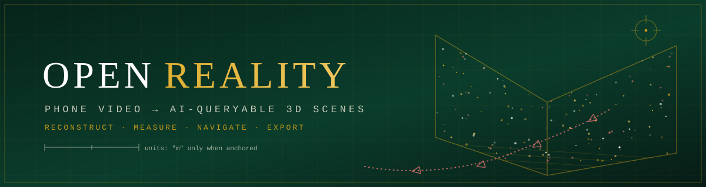
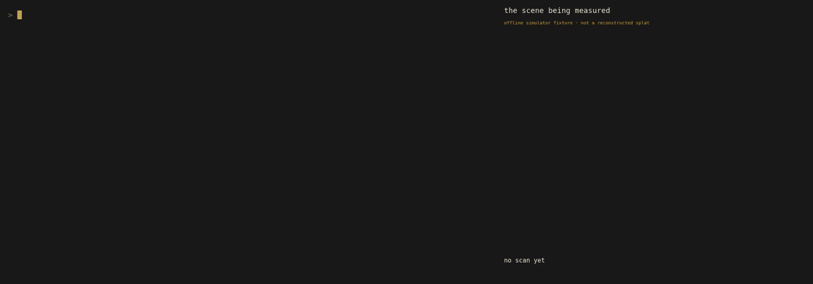
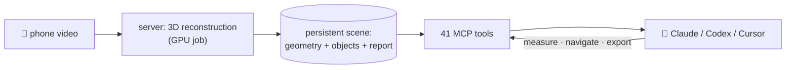

<p align="center">
  <a href="https://open-reality.io"></a>
</p>

<p align="center">
  <b>Scan a room with your phone. Ask your AI assistant about it.</b><br/>
  Open Reality turns plain video into a 3D scene your AI can measure, navigate,
  and export as robot-training data. Works from Claude Code, Claude desktop, Codex, and Cursor.
</p>

<p align="center">
  <a href="https://www.npmjs.com/package/openreality-mcp"></a>
  <!-- <a href="https://github.com/reality-opened/openreality/actions/workflows/ci.yml"></a> -->
  <a href="LICENSE"></a>
  
  
  <!-- 
   -->
  <a href="#-contributing"></a>
</p>

<p align="center">
  <a href="README.md"></a>
  <a href="README.zh.md"></a>
</p>

<p align="center">
  <a href="https://open-reality.io">Website</a> ·
  <a href="#-get-started-in-60-seconds">Get started</a> ·
  <a href="#-things-you-can-ask">Things you can ask</a> ·
  <a href="#-run-it-yourself">Self-host</a> ·
  <a href="mcp/README.md">MCP docs</a> ·
  <a href="#-contributing">Contributing</a>
</p>

---

<p align="center">
  
  <br/>
  <sub>Demo v1: a real Claude Code (Opus) session against the built-in offline simulator, beside a synchronized scene panel. Video: <a href="docs/demo/demo-video-v1.mp4">docs/demo/demo-video-v1.mp4</a>. Rendered from <a href="docs/demo/">docs/demo/</a> with <a href="https://github.com/charmbracelet/vhs">VHS</a>.</sub>
</p>

<p align="center">
  
  <br/>
  <sub>Live reconstruction from a handheld video: the camera path and the 3D scene build up together. Scan demo and the initial technical idea: <a href="https://github.com/MIT-SPARK/VGGT-SLAM">VGGT-SLAM</a> by Dominic Maggio, Hyungtae Lim and Luca Carlone (MIT SPARK Lab). Open Reality's reconstruction core builds on their work.</sub>
</p>

##  Utilities

| | |
|---|---|
| 🎥 &nbsp;**Video in, 3D scene out** | Upload a phone video. A few minutes later you have a persistent 3D scene. |
| 📏 &nbsp;**Measurement** | Distances and angles between any points. Numbers are only called metres after you calibrate with real distance; otherwise relative.|
| 🧭 &nbsp;**Path planning** | Plan a route through the scanned free space to an object or a point. |
| 🤖 &nbsp;**Robot-training exports** | Turns a scan into LeRobot / GR00T style datasets or an Isaac Sim scene (hosted service). |
| 🕵️ &nbsp;**Scene agents** | Server-side agents that survey, label, and answer questions about a scene. |
| 🛠️ &nbsp;**41 tools for your AI** | Everything is exposed through MCP. |
| 🧪 &nbsp;**Offline simulator** | A mock backend fakes the entire workflow with fixture data, so you can develop and demo with no account and no GPU. |
| 🏠 &nbsp;**Self-hostable** | The full server runs on your own GPU box or your own Modal account, no account with us needed. |

## Quickstart

Add the tools to your AI assistant:

```bash
claude mcp add openreality -- npx -y openreality-mcp serve

codex mcp add openreality -- npx -y openreality-mcp serve
```

<details>
<summary><b>Claude desktop / Cursor</b> (click to expand)</summary>

Add this to `claude_desktop_config.json` (Settings → Developer → Edit Config)
or `~/.cursor/mcp.json`:

```json
{
  "mcpServers": {
    "openreality": {
      "command": "npx",
      "args": ["-y", "openreality-mcp", "serve"]
    }
  }
}
```

</details>

Then sign in once (opens your browser, stores a revocable API key on your machine):

```bash
npx -y openreality-mcp login
```

Scan a room with your phone at [open-reality.io](https://open-reality.io), or just ask
your assistant to upload a video file. Full per-client setup:
[open-reality.io/mcp](https://open-reality.io/mcp).

## Examples

Once connected, talk to your assistant like this:

> "Upload `~/Videos/kitchen.mp4` and reconstruct it."

> "What objects are in my latest scan, and how big is the room?"

> "The counter edge to the window is 2.4 m. Calibrate the scene, then measure the couch."

> "Plan a path from the door to the desk and describe it."

> "Export this scan as robot-training data and save the zip locally."

## Self Hosting

The whole workflow is self-hostable. Read
[`server/docs/self-hosting.md`](server/docs/self-hosting.md); the short version:

```bash
git clone https://github.com/reality-opened/openreality
cd openreality/server

# Path A: your own GPU box (one process, local disk)
python -m server.selfhost --data-dir ~/openreality-data

# Path B: your own Modal account (CPU web server + GPU worker)
modal deploy modal_selfhost.py
```

Self-hosted servers need no account: a single token printed at first start is
your login, and the MCP client connects with `OPENREALITY_URL` plus that token.

> [!IMPORTANT]
> **Licensing.** This repo is BSD-2-Clause, but the 3D reconstruction model a
> self-hosted server downloads (VGGT-1B and the VGGT code it runs on) is
> licensed by its owners as **CC BY-NC 4.0, non-commercial use only**. Nothing
> here redistributes it; your server fetches it from the source under their
> terms. For commercial use, use the hosted service (which runs a commercially
> licensed model) or get your own license from the model owners.

## Repo index

| Directory | What it is | Ships as |
|---|---|---|
| [`mcp/`](mcp/) | The MCP server: 41 tools, scene resources, the offline simulator, and a full test suite. Developed here directly. | npm [`openreality-mcp`](https://www.npmjs.com/package/openreality-mcp) |
| [`server/`](server/) | The backend: turns videos into persistent scenes and serves measurement, planning, agents, and exports over a plain REST API. | source (public mirror) |
| [`core/`](core/) | The 3D reconstruction library: camera tracking and dense geometry from ordinary video (the VGGT-SLAM 2.0 line), plus metric calibration, object detection, and splat export. | source (public mirror) |

`server/` and `core/` are curated mirrors of our private working repos, synced
by hand; each carries a `MIRROR.md` that says exactly what is included and how
it is synced. `mcp/` is developed in this repo directly.

## Technical details



The MCP process always runs on your machine and holds your credentials; every
tool call is a typed REST call to a server (ours or yours). Big files are
written to your disk, never pasted into the AI's context. Server refusals and
uncertainty labels reach the AI unedited, so it cannot pretend a relative
number is metres.


## 🤝 Contributing

Issues and pull requests are welcome on any component. Changes to `mcp/` land
here directly; fixes to `server/` and `core/` are folded back into the private
working repos and re-synced out. If you self-host and something breaks, an
issue with your logs is a gift: the self-host paths are young.

##  License

[BSD-2-Clause](LICENSE) for everything in this repository. Third-party models
are fetched from their owners under their own licenses (see the licensing note
above and [`server/docs/self-hosting.md`](server/docs/self-hosting.md)).

---

<p align="center">
  <a href="https://www.star-history.com/#reality-opened/openreality&Date"></a>
</p>

<p align="center">
  <sub>Built by <a href="https://github.com/reality-opened">reality-opened</a> · <a href="https://open-reality.io">open-reality.io</a></sub>
</p>
