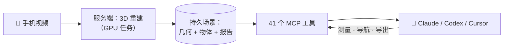

<p align="center">
  <a href="https://open-reality.io"></a>
</p>

<p align="center">
  <b>用手机扫一个房间，然后让你的 AI 助手回答关于它的问题。</b><br/>
  Open Reality 把普通视频变成 3D 场景：AI 可以测量它、在里面规划路径，
  还能导出机器人训练数据。支持 Claude Code、Claude 桌面版、Codex 和 Cursor。
</p>

<p align="center">
  <a href="https://www.npmjs.com/package/openreality-mcp"></a>
  <a href="https://github.com/reality-opened/openreality/actions/workflows/ci.yml"></a>
  <a href="LICENSE"></a>
  
  
  
  
  <a href="#-参与贡献"></a>
</p>

<p align="center">
  <a href="README.md"></a>
  <a href="README.zh.md"></a>
</p>

<p align="center">
  <a href="https://open-reality.io">官网</a> ·
  <a href="#-60-秒上手">快速上手</a> ·
  <a href="#-你可以这样问">示例提问</a> ·
  <a href="#-自己部署">自托管</a> ·
  <a href="mcp/README.md">MCP 文档</a> ·
  <a href="#-参与贡献">参与贡献</a>
</p>

---

<p align="center">
  
  <br/>
  <sub>手持视频的实时重建：相机轨迹和 3D 场景同步生长。</sub>
</p>

## ✨ 它能做什么

| | |
|---|---|
| 🎥 &nbsp;**视频进，3D 场景出** | 上传一段手机视频，几分钟后得到一个持久保存的 3D 场景：几何结构、相机轨迹、检测到的物体，还有一份文字报告。 |
| 📏 &nbsp;**诚实的测量** | 测任意两点间的距离和角度。只有在你用一段真实距离校准之后，数字才会以米为单位；在那之前它们会被明确标注为相对单位，绝不冒充。 |
| 🧭 &nbsp;**路径规划** | 在扫描出的可通行空间里规划一条到某个物体或某个点的路线；目标不可达时会诚实报错。 |
| 🤖 &nbsp;**机器人训练数据导出** | 一条命令把扫描变成 LeRobot / GR00T 风格的数据集，或 Isaac Sim 场景（托管服务）。 |
| 🕵️ &nbsp;**场景智能体** | 服务端智能体自动巡视、标注并回答关于场景的问题，预算有上限，事件日志可回放。 |
| 🛠️ &nbsp;**给 AI 的 41 个工具** | 一切都通过 MCP（Model Context Protocol，AI 助手调用外部工具的标准协议）暴露出来，Claude、Codex、Cursor 都能用自然语言驱动整个流程。 |
| 🧪 &nbsp;**离线模拟器** | 一个假后端用内置数据模拟完整流程，开发和演示不需要账号，也不需要 GPU。 |
| 🏠 &nbsp;**可以自托管** | 完整服务端可以跑在你自己的 GPU 机器或你自己的 Modal 账号上，不需要我们的账号。 |

## 🚀 60 秒上手

把工具加进你的 AI 助手（会启动一个小的本地进程，不做全局安装）：

```bash
# Claude Code
claude mcp add openreality -- npx -y openreality-mcp serve

# Codex
codex mcp add openreality -- npx -y openreality-mcp serve
```

<details>
<summary><b>Claude 桌面版 / Cursor</b>（点击展开）</summary>

把下面的配置加进 `claude_desktop_config.json`（设置 → Developer → Edit Config）
或 `~/.cursor/mcp.json`：

```json
{
  "mcpServers": {
    "openreality": {
      "command": "npx",
      "args": ["-y", "openreality-mcp", "serve"]
    }
  }
}
```

</details>

然后登录一次（会打开浏览器，并在你的机器上保存一个可随时吊销的 API key）：

```bash
npx -y openreality-mcp login
```

用手机在 [open-reality.io](https://open-reality.io) 扫一个房间，或者直接让助手上传一个视频文件。
各客户端的完整配置见 [open-reality.io/mcp](https://open-reality.io/mcp)。

## 💬 你可以这样问

连接之后，直接对助手说：

> “上传 `~/Videos/kitchen.mp4` 并重建它。”

> “我最新的扫描里有哪些物体？这个房间有多大？”

> “台面边缘到窗户是 2.4 米。先校准场景，然后量一下沙发。”

> “规划一条从门到书桌的路径，并描述它。”

> “把这个扫描导出成机器人训练数据，把 zip 存到本地。”

## 🏠 自己部署

整个流程都可以自托管。完整文档见
[`server/docs/self-hosting.md`](server/docs/self-hosting.md)；简短版：

```bash
git clone https://github.com/reality-opened/openreality
cd openreality/server

# 路线 A：你自己的 GPU 机器（单进程，本地磁盘）
python -m server.selfhost --data-dir ~/openreality-data

# 路线 B：你自己的 Modal 账号（CPU 网络服务 + GPU 工作进程）
modal deploy modal_selfhost.py
```

自托管的服务端不需要注册账号：首次启动打印的一个 token 就是你的登录凭证，
MCP 客户端用 `OPENREALITY_URL` 加这个 token 连接。

> [!IMPORTANT]
> **许可说明。** 本仓库采用 BSD-2-Clause 协议，但自托管服务端下载的 3D 重建模型
> （VGGT-1B 权重及其运行代码）由其所有者按 **CC BY-NC 4.0（仅限非商业用途）**
> 授权。本仓库不二次分发它们；你的服务端会按对方的条款从源头获取。
> 商业用途请使用托管服务（它运行的是商业授权的模型），或自行向模型所有者取得授权。

## 📦 仓库里有什么

| 目录 | 是什么 | 发布形式 |
|---|---|---|
| [`mcp/`](mcp/) | MCP 服务器：41 个工具、场景资源、离线模拟器和完整测试套件。直接在本仓库开发。 | npm [`openreality-mcp`](https://www.npmjs.com/package/openreality-mcp) |
| [`server/`](server/) | 后端：把视频变成持久场景，并通过普通 REST API 提供测量、规划、智能体和导出。 | 源码（公开镜像） |
| [`core/`](core/) | 3D 重建库：从普通视频做相机跟踪和稠密几何（VGGT-SLAM 2.0 系列），外加公制校准、物体检测和 splat 导出。 | 源码（公开镜像） |

`server/` 和 `core/` 是我们私有工作仓库的精选镜像，人工同步；每个目录里的
`MIRROR.md` 写明了收录内容和同步方式。`mcp/` 直接在本仓库开发。

## 🧠 工作原理



MCP 进程永远跑在你自己的机器上，凭证也保存在本地；每个工具调用都是对服务端
（我们的或你自己的）的一次类型化 REST 请求。大文件写到你的磁盘，绝不塞进 AI
的上下文。服务端的拒绝和不确定性标注会原样到达 AI，它没法把相对单位说成米。

## 🧑‍💻 开发

```bash
cd mcp && npm install && npm test        # 59 个测试：单元、契约、生命周期、端到端
cd server && python -m pytest tests/     # 1200+ 个无 GPU 测试
cd mcp && npm run simulator              # 假后端跑在 :8973，不需要 GPU 和账号
```

每次 push 都会在 CI 里跑全部三套测试。

## 🤝 参与贡献

欢迎对任何组件提 issue 和 PR。`mcp/` 的改动直接在这里合并；`server/` 和
`core/` 的修复会先合入私有工作仓库，再同步回来。如果你在自托管时遇到问题，
带日志的 issue 就是最好的礼物：自托管路径还很年轻。

## ⚖️ 许可

本仓库内的一切均为 [BSD-2-Clause](LICENSE)。第三方模型由你的部署按其所有者的
条款自行获取（见上面的许可说明和
[`server/docs/self-hosting.md`](server/docs/self-hosting.md)）。

---

<p align="center">
  <a href="https://www.star-history.com/#reality-opened/openreality&Date"></a>
</p>

<p align="center">
  <sub>由 <a href="https://github.com/reality-opened">reality-opened</a> 打造 · <a href="https://open-reality.io">open-reality.io</a></sub>
</p>
